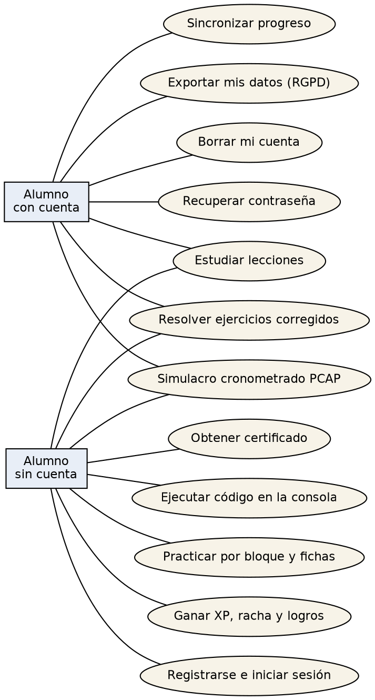
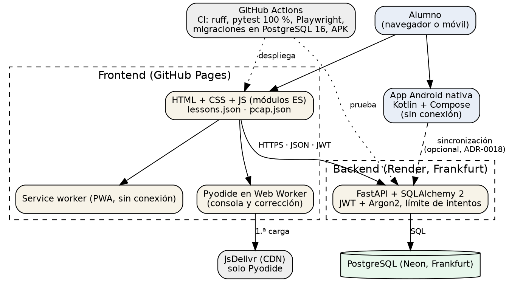
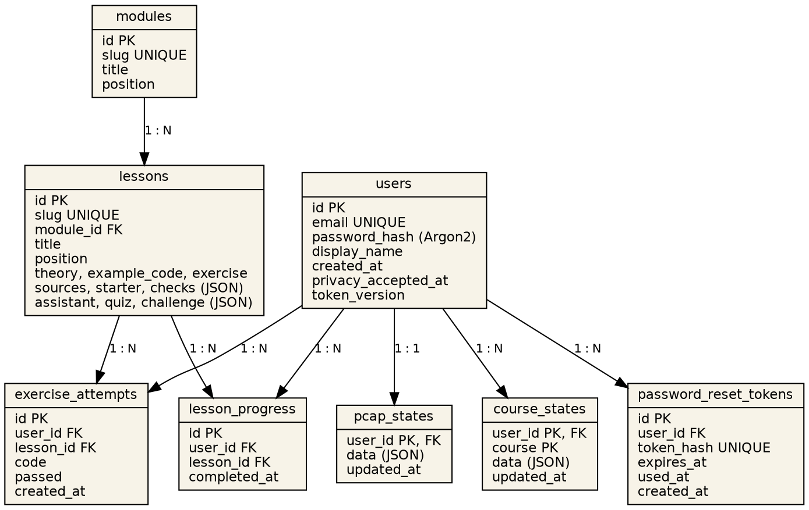

**Ciclo formativo:** Desarrollo de Aplicaciones Web (DAW), modalidad online · **Centro:** Alcazarén Formación · **Tutor/a:** [VERIFY] · **Curso:** [VERIFY] · **Repositorio:** <https://github.com/Marbi8891/python-learning-dashboard> · **Demo:** <https://marbi8891.github.io/python-learning-dashboard/>

> Nota de redacción: los datos marcados como **[VERIFY]** son datos personales, fechas o cifras que solo el autor puede confirmar. Todo lo demás se ha extraído del código, los ADR y el README del repositorio.

# Resumen

Python Learning Dashboard es una academia web para preparar el examen PCAP (Certified Associate in Python Programming): 27 lecciones con teoría propia, una consola de Python que se ejecuta en el navegador, ejercicios corregidos automáticamente, simulacros cronometrados de 40 preguntas en 65 minutos y un sistema de estudio guiado con repaso espaciado. Incluye cuenta opcional con sincronización entre dispositivos y cumplimiento del RGPD, una PWA que funciona sin conexión y una app Android nativa en Kotlin con cursos de Bases de datos, Entornos de desarrollo, JavaScript y Java, alineados con el temario de DAW.

El proyecto sigue una arquitectura de frontend estático (GitHub Pages) más API REST (FastAPI) con PostgreSQL, documentada en 19 registros de decisiones de arquitectura (ADR), con 412 pruebas de backend al 100 % de cobertura, pruebas end-to-end con Playwright, auditoría automática de accesibilidad WCAG 2.1 AA e integración continua.

**Palabras clave:** aprendizaje en línea, Python, PCAP, FastAPI, PWA, Pyodide, accesibilidad, RGPD, Android.

**Abstract.** Python Learning Dashboard is a web academy to prepare for the PCAP exam, with in-browser Python execution (Pyodide), auto-graded exercises, timed mock exams, spaced repetition and optional cross-device sync. It is built as a static frontend plus a FastAPI/PostgreSQL REST API, complemented by an offline Android app in Kotlin. Quality is backed by 100 % backend test coverage, end-to-end tests, automated WCAG 2.1 AA audits and CI.

# 1. Introducción y justificación

## 1.1 Problema

Quien se prepara el PCAP se encuentra con recursos dispersos: documentación oficial sin práctica guiada, cursos de pago en inglés y bancos de preguntas sin explicación. Además, ejecutar código exige instalar un entorno, lo que frena a los principiantes. En paralelo, los módulos de DAW (Programación, Bases de datos, Entornos de desarrollo, Entorno cliente) tienen el mismo problema: teoría en un sitio, práctica en otro y ninguna forma de comprobar el progreso.

## 1.2 Solución propuesta

Una única plataforma en español que junta teoría, ejecución de código real, corrección automática, simulacros con el reparto oficial del examen y un sistema de seguimiento del progreso, sin instalar nada y sin necesidad de crear cuenta. El código de las preguntas se comprueba ejecutándolo, de modo que cada respuesta del banco está verificada.

## 1.3 Alcance y relación con el ciclo

El proyecto integra competencias de varios módulos de DAW: programación (Python, Java, JavaScript), bases de datos (modelo relacional, SQLAlchemy, migraciones con Alembic, PostgreSQL), entorno cliente (JavaScript con módulos ES, PWA, Web Workers), entorno servidor (API REST con FastAPI), diseño de interfaces (diseño editorial, accesibilidad WCAG) y despliegue (GitHub Pages, Docker, Render, CI/CD).

# 2. Objetivos

**Objetivo general.** Diseñar, construir y desplegar una plataforma educativa para preparar el PCAP y refuerzo de módulos de DAW, con calidad de producción.

**Objetivos específicos.**

1. Ofrecer el temario completo del PCAP dividido según los bloques oficiales del examen.
2. Ejecutar Python real en el navegador, sin servidor de ejecución, con corte de bucles infinitos.
3. Corregir ejercicios automáticamente y verificar cada respuesta del banco de preguntas.
4. Permitir el uso sin cuenta y ofrecer cuenta opcional con sincronización y derechos RGPD.
5. Garantizar accesibilidad (WCAG 2.1 AA) verificada automáticamente en tema claro y oscuro.
6. Funcionar sin conexión (PWA y app Android).
7. Mantener un proceso de ingeniería reproducible: pruebas, CI, migraciones y ADR.

**Fuera de alcance.** Certificación oficial, pagos, tutoría en directo, ejecución de código en servidor y publicación en Google Play (la app Android se distribuye como APK firmado).

# 3. Análisis

## 3.1 Actores

- **Alumno sin cuenta:** usa toda la plataforma; el progreso se guarda en su navegador.
- **Alumno con cuenta:** además sincroniza el progreso entre dispositivos y ejerce sus derechos RGPD.
- **Administrador/autor:** publica el contenido (fuente única `lessons.json`) y despliega.

## 3.2 Requisitos funcionales

| Id | Requisito |
|---|---|
| RF-01 | Navegar un temario organizado en módulos y 27 lecciones. |
| RF-02 | Ejecutar código Python en una consola interactiva con `input()` y errores con línea exacta. |
| RF-03 | Corregir ejercicios con pruebas automáticas; superarlas completa la lección. |
| RF-04 | Mini-quiz de 3 preguntas por lección (81 en total) con explicación de cada opción. |
| RF-05 | Simulacro de 40 preguntas en 65 minutos con el reparto oficial de bloques. |
| RF-06 | Práctica por bloque con corrección inmediata, 48 fichas de repaso y panel de preparación. |
| RF-07 | Banco de 126 preguntas en español o inglés, seleccionable. |
| RF-08 | XP, niveles, racha y 20 logros. |
| RF-09 | Repaso espaciado y plan semanal a partir de la fecha del examen. |
| RF-10 | Registro, inicio de sesión y recuperación de contraseña. |
| RF-11 | Sincronizar progreso y preparación entre dispositivos. |
| RF-12 | Descargar los datos personales (JSON) y borrar la cuenta. |
| RF-13 | Certificado de finalización imprimible (no oficial). |
| RF-14 | Temas claro, oscuro y automático, y tres tamaños de letra. |
| RF-15 | App Android con ruta de unidades, vidas, racha, juego y cursos de DAW. |

## 3.3 Requisitos no funcionales

| Id | Requisito | Cómo se verifica |
|---|---|---|
| RNF-01 | Accesibilidad WCAG 2.1 AA, teclado y menú móvil | Auditoría automática en Playwright, en los dos temas |
| RNF-02 | Privacidad: sin cookies, datos mínimos, RGPD | Política de privacidad, exportación y borrado |
| RNF-03 | Seguridad: Argon2, JWT, límite de intentos, cierre de sesiones al cambiar la contraseña | Pruebas de backend |
| RNF-04 | Fiabilidad: 100 % de cobertura en backend, migraciones probadas en PostgreSQL 16 | CI |
| RNF-05 | Rendimiento: sin framework, fuentes y resaltado alojados en local, service worker | Medición (ver 6.5) |
| RNF-06 | Disponibilidad sin conexión | PWA y app Android sin permiso de internet (ADR-0014) |
| RNF-07 | Mantenibilidad: decisiones documentadas y contenido en fuente única | 19 ADR |

## 3.4 Casos de uso



## 3.5 Alternativas consideradas

- **Ejecutar el código en servidor** (frente a Pyodide en el navegador): más potente, pero caro, con riesgo de seguridad por código ajeno y peor sin conexión. Se descartó (ADR-0004).
- **Framework SPA (React, Vue)** frente a JavaScript con módulos ES: se eligió lo segundo para reducir peso y complejidad, ya que el contenido es mayoritariamente estático (ADR-0001).
- **Cuenta obligatoria** frente a cuenta opcional: se eligió opcional para reducir fricción y minimizar datos personales (ADR-0003).

# 4. Diseño

## 4.1 Arquitectura



El frontend es estático y se publica en GitHub Pages. El backend FastAPI se despliega en Render (Frankfurt) con PostgreSQL en Neon (Frankfurt), de modo que los datos permanecen en la UE. La ejecución de Python ocurre en el navegador dentro de un Web Worker. La app Android usa los mismos datos JSON que la web y sincroniza con la cuenta de forma opcional.

## 4.2 Modelo de datos



Las tablas de contenido (`modules`, `lessons`) se cargan desde `lessons.json` con un script de siembra. El progreso, los intentos y los tokens se borran en cascada al eliminar el usuario, lo que hace efectivo el derecho de supresión. Los estados de preparación del PCAP y de los cursos se guardan como JSON por usuario para poder evolucionar sin migraciones frecuentes. Los tokens de recuperación se almacenan como hash y caducan a los 30 minutos.

## 4.3 API REST

| Método | Ruta | Descripción |
|---|---|---|
| GET | `/api/health` | Estado del servicio |
| GET | `/api/modules` | Módulos con sus lecciones |
| GET | `/api/lessons/{slug}` | Lección completa |
| POST | `/api/auth/register` | Crear cuenta (exige aceptar la privacidad) |
| POST | `/api/auth/login` | Iniciar sesión (OAuth2, devuelve token) |
| POST | `/api/auth/password-reset/request` y `/confirm` | Recuperación de contraseña |
| GET | `/api/users/me`, `/me/export` | Usuario y exportación RGPD |
| POST | `/api/users/me/delete` | Borrado de cuenta (pide contraseña) |
| GET, PUT, DELETE | `/api/progress`, `/api/progress/{slug}` | Progreso de lecciones |
| POST, GET | `/api/lessons/{slug}/attempts` | Intentos de ejercicio |
| GET, PUT | `/api/pcap-state` | Preparación del PCAP |
| GET, PUT | `/api/course-state/{curso}` | Estado de cursos de la app Android |

La documentación interactiva (OpenAPI) se genera automáticamente en `/docs`.

## 4.4 Seguridad

Contraseñas con Argon2, sesiones con JWT y campo `token_version` que invalida todas las sesiones al cambiar la contraseña, límite de intentos de inicio de sesión por IP, CORS restringido a los orígenes del frontend, tokens de recuperación guardados como hash y, en la versión 1.0.0, cabeceras de seguridad en toda la API (`X-Content-Type-Options`, `X-Frame-Options`, `Referrer-Policy`, `Strict-Transport-Security` y `Permissions-Policy`). El código enviado en los ejercicios se ejecuta solo en el navegador del propio alumno.

## 4.5 Interfaz y experiencia de usuario

Diseño editorial (tinta, marfil y dorado, titulares en serif) con tipografías alojadas en local, portada con «Continuar donde lo dejaste», guía Aprende, Practica y Comprueba en cada lección, y consola al lado en pantallas anchas. Accesibilidad: enlace de salto al contenido, navegación por teclado, contraste verificado y reducción de movimiento respetada en la animación de confeti.

## 4.6 Registro de decisiones (ADR)

| ADR | Decisión |
|---|---|
| 0001 | Arquitectura: monorepo, frontend estático más API aparte |
| 0002 | Contenido de lecciones en fuente única |
| 0003 | Autenticación y corrección de ejercicios |
| 0004 | Consola en el navegador, corrección y privacidad |
| 0005 | Gamificación |
| 0006 | Experiencia del alumno |
| 0007 | Estética editorial |
| 0008 | Backend en Render y base de datos en Neon |
| 0009 | Enfoque en el examen PCAP |
| 0010 | Estudio guiado, sincronización y PWA |
| 0011 a 0015 | App Android: nativa, estilo Duolingo, firma, sin conexión, modo Jugar |
| 0016 a 0019 | Cursos de DAW, ejercicios de escribir código, sincronización, temario del centro |

# 5. Implementación

## 5.1 Tecnologías

| Capa | Tecnología |
|---|---|
| Frontend | HTML, CSS y JavaScript (módulos ES, sin framework), highlight.js, Pyodide (Python 3.14 en WebAssembly) |
| Backend | Python 3.11+, FastAPI, SQLAlchemy 2, Alembic, Pydantic, PyJWT, argon2-cffi |
| Datos | PostgreSQL (producción) y SQLite (local y tests) |
| Android | Kotlin, Jetpack Compose |
| Calidad | pytest, Ruff, Playwright, GitHub Actions |
| Despliegue | GitHub Pages, Render, Neon, Docker |

## 5.2 Estructura del repositorio

`frontend/` (aplicación web y datos), `backend/` (API, migraciones y pruebas), `android/` (app nativa), `e2e/` (pruebas de extremo a extremo y accesibilidad), `docs/` (ADR, despliegue y esta memoria), `scripts/` (versión de escritorio y verificación de cursos).

## 5.3 Aspectos relevantes

**Ejecución segura de Python.** Pyodide corre en un Web Worker, así que la interfaz no se bloquea. Un temporizador corta los bucles infinitos a los 10 segundos. Al ser código ejecutado en el cliente, no hay superficie de ataque en el servidor.

**Corrección compartida.** El motor `py/runner.py` ejecuta y corrige tanto en el navegador como en CI. Cada respuesta de las 126 preguntas del PCAP lleva una comprobación en Python que demuestra su corrección, y los cursos de la app se verifican ejecutando el código en SQLite, Node, Java y Python.

**Modo sin cuenta como opción de primera clase.** Con `apiUrl` vacío toda la app funciona con `localStorage`. La cuenta añade sincronización mediante fusión del progreso local con el del servidor.

**PWA.** El service worker sirve la web con estrategia de red primero y guarda Pyodide (unos 10 MB inmutables) en caché aparte para no volver a descargarlo.

**Versión de escritorio.** `Iniciar-Dashboard.bat` levanta web y API en local, accesibles solo desde el propio equipo.

# 6. Pruebas y calidad

## 6.1 Resumen

| Suite | Alcance | Resultado |
|---|---|---|
| Backend (pytest) | API, seguridad, RGPD, migraciones, contenido y banco del PCAP | 412 pruebas, cobertura del 100 % |
| End-to-end (Playwright) | App completa con backend real, consola Python | 10 ficheros de pruebas |
| Accesibilidad | Auditoría WCAG 2.1 AA en tema claro y oscuro | Automática en CI |
| Calidad de código | Ruff (PEP 8 y formato) | Sin incidencias |
| Cursos | Cada respuesta de código se ejecuta | Automática |
| Migraciones | Alembic contra PostgreSQL 16, con base vacía y con datos | Automática en CI |
| Android | Pruebas unitarias del dominio y lint | Automática en CI |

## 6.2 Integración continua

Cada `push` ejecuta lint, formato, pruebas con cobertura mínima del 100 %, migraciones en PostgreSQL, pruebas end-to-end y compilación del APK. El despliegue del frontend a Pages es automático al cambiar `frontend/`.

## 6.3 Pruebas manuales

[VERIFY: completar tras probar en dispositivos reales]

| Prueba | Dispositivo | Resultado |
|---|---|---|
| Navegación completa a 375 px | [VERIFY] | [VERIFY] |
| Recorrido solo con teclado | [VERIFY] | [VERIFY] |
| Vista previa al compartir por WhatsApp | [VERIFY] | [VERIFY] |
| Página 404 | [VERIFY] | [VERIFY] |
| Uso sin conexión (PWA y app Android) | [VERIFY] | [VERIFY] |

## 6.4 Accesibilidad

Además de la auditoría automática, la web incorpora un enlace de salto al contenido, iconos decorativos ocultos a los lectores de pantalla y respeto a la preferencia de reducir el movimiento. Las pruebas automáticas no sustituyen a una revisión manual, que queda como limitación conocida.

## 6.5 Rendimiento

Sin framework, la portada carga unos 222 KB de HTML, CSS y JS sin comprimir, más 26 KB de highlight.js y 18 KB de la fuente precargada. El fichero de lecciones (225 KB, unos 60 KB comprimido) es el recurso más pesado. Resultados de Lighthouse: [VERIFY: ejecutar Lighthouse en Chrome y anotar rendimiento, accesibilidad, buenas prácticas y SEO].

# 7. Despliegue

Frontend en GitHub Pages mediante el workflow `pages.yml`. Backend como contenedor Docker en Render con PostgreSQL en Neon, definido en `render.yaml`. Variables sensibles (`JWT_SECRET`, credenciales de base de datos y SMTP) como secretos del proveedor, nunca en el repositorio. Guía completa en `docs/DEPLOY.md`. La versión de escritorio para Windows se ejecuta con `Iniciar-Dashboard.bat`.

La app Android se distribuye como APK firmado desde GitHub Actions (ADR-0013). La clave de firma nunca se guarda en el repositorio.

# 8. Aspectos legales y éticos

- **RGPD:** política de privacidad con responsable, finalidades, bases legales, encargados, plazos y derechos. Acceso y portabilidad con la descarga en JSON, y supresión con el borrado de cuenta en cascada.
- **LSSI:** aviso legal con la identificación del titular.
- **Cookies:** no se usan. `localStorage` se emplea solo para funciones que pide el usuario y es estrictamente necesario, por lo que no requiere banner.
- **Analítica:** opcional y desactivada por defecto. Si se activa, se usa GoatCounter, que no emplea cookies, y la política de privacidad lo indica.
- **Terceros:** Pyodide se sirve desde jsDelivr la primera vez que se usa la consola, lo que implica que reciben la IP del visitante. Está declarado en la política.
- **Licencias:** código bajo MIT; fuentes Inter, JetBrains Mono y Fraunces (OFL). PCAP es una marca de Python Institute y el proyecto no está afiliado; el certificado que genera es no oficial.
- **Contenido:** las explicaciones y preguntas son originales, con fuentes enlazadas.

# 9. Planificación y costes

## 9.1 Planificación

[VERIFY: el historial de Git del repositorio contiene 23 commits entre el 25 y el 28 de septiembre de 2026. Si el proyecto se ha trabajado antes en otro repositorio o en local, indícalo aquí con las fechas reales; el tribunal puede preguntarlo.]

| Fase | Contenido | Fechas | Horas |
|---|---|---|---|
| Análisis y diseño | Requisitos, arquitectura, ADR 0001 a 0004 | [VERIFY] | [VERIFY] |
| Núcleo web | Lecciones, consola, ejercicios | [VERIFY] | [VERIFY] |
| Cuenta y backend | Autenticación, sincronización, RGPD | [VERIFY] | [VERIFY] |
| Examen PCAP | Simulacros, fichas, repaso | [VERIFY] | [VERIFY] |
| App Android | Ruta, juego, cursos de DAW | [VERIFY] | [VERIFY] |
| Calidad y despliegue | Pruebas, CI, accesibilidad, publicación | [VERIFY] | [VERIFY] |
| Memoria y defensa | Documentación y presentación | [VERIFY] | [VERIFY] |

## 9.2 Costes de infraestructura

| Concepto | Proveedor | Coste |
|---|---|---|
| Frontend | GitHub Pages | 0 € |
| API | Render (plan gratuito) | 0 € [VERIFY: condiciones vigentes] |
| Base de datos | Neon (plan gratuito) | 0 € [VERIFY: condiciones vigentes] |
| Dominio propio | Opcional | [VERIFY] |
| Email transaccional | Pendiente de elegir | [VERIFY] |

Limitación del plan gratuito: el servicio del backend puede tardar en responder tras un periodo de inactividad [VERIFY]. El modo sin cuenta y la app Android sin conexión no dependen del backend.

## 9.3 Coste de desarrollo y viabilidad

Coste de desarrollo estimado: horas totales [VERIFY] × tarifa horaria de referencia [VERIFY] = [VERIFY] €. Si se explotara comercialmente, el mayor riesgo es de contenido, ya que el examen PCAP cambia con el tiempo, y no técnico. Este análisis se completa cuando el autor decida si el proyecto seguirá siendo educativo y gratuito.

# 10. Conclusiones y líneas futuras

## 10.1 Conclusiones

Se ha construido una plataforma completa (web, API y app Android) que cumple los objetivos: temario PCAP completo, Python real en el navegador, corrección automática, cuenta opcional con RGPD, accesibilidad verificada automáticamente y funcionamiento sin conexión. La principal aportación técnica es el equilibrio entre un frontend estático y ligero y un backend mínimo solo para lo que lo necesita. El proceso de ingeniería (ADR, pruebas al 100 % en backend, CI) hace el proyecto reproducible y mantenible.

## 10.2 Limitaciones

Recuperación de contraseña por email pendiente de configurar SMTP; revisión manual de accesibilidad pendiente; plan gratuito del backend con arranque lento tras inactividad; ejecución de Python en la app Android pendiente (Chaquopy); simulacro cronometrado en Android pendiente.

## 10.3 Líneas futuras

Activar el email de recuperación, completar la app Android (simulacro, Python real, sincronización de cursos), curso de HTML/CSS, panel de estadísticas de uso con la analítica sin cookies y ampliación a otros exámenes de certificación.

# Bibliografía y fuentes

- Python Institute. *PCAP: Certified Associate in Python Programming, exam syllabus* (PCAP-31-03).
- Python Software Foundation. *The Python Tutorial* y *Python Language Reference*.
- Severance, C. *Python para todos* (PY4E).
- Documentación oficial de FastAPI, SQLAlchemy, Alembic, Pyodide, Playwright, Kotlin y Jetpack Compose.
- W3C. *Web Content Accessibility Guidelines (WCAG) 2.1*.
- Reglamento (UE) 2016/679 (RGPD); Ley 34/2002 (LSSI-CE); Ley Orgánica 3/2018 (LOPDGDD).
- Nygard, M. *Documenting Architecture Decisions* (formato ADR).

# Anexo A. Manual de usuario

1. Abre la web y pulsa una lección en la «Ruta de aprendizaje», o «Continuar donde lo dejaste».
2. Lee la teoría, prueba el ejemplo con «Probar en la consola» y resuelve el ejercicio: al superar las pruebas la lección se completa.
3. Responde el mini-quiz. Cada respuesta explica por qué es correcta o no.
4. En «Examen PCAP» elige simulacro (40 preguntas, 65 minutos) o práctica por bloque, y consulta el panel de preparación.
5. Crea una cuenta si quieres sincronizar el progreso entre dispositivos; puedes descargar tus datos o borrar la cuenta en «Tu cuenta».
6. Ajusta tema y tamaño de letra en «Aspecto». Instala la app desde el navegador para usarla sin conexión.

# Anexo B. Manual de instalación

**Uso inmediato (Windows):** doble clic en `Iniciar-Dashboard.bat` (requiere Python 3.11 o superior).

**Desarrollo:**

```
cd backend
python -m venv .venv && .venv\Scripts\activate
pip install -r requirements-dev.txt
copy .env.example .env      # define JWT_SECRET
alembic upgrade head && python -m app.seed
uvicorn app.main:app --reload

cd ../frontend
python -m http.server 5500
```

**Todo con Docker:** `JWT_SECRET=<valor> docker compose up --build`.

**Pruebas:** `cd backend && python -m pytest --cov=app` y `npm ci && npx playwright install chromium && npm run test:e2e`.
